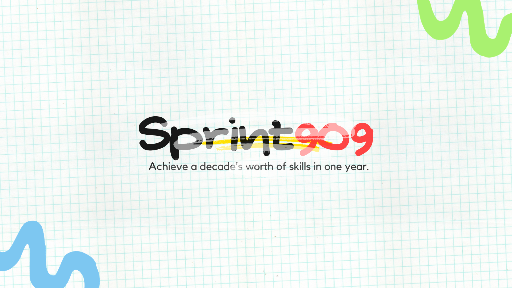
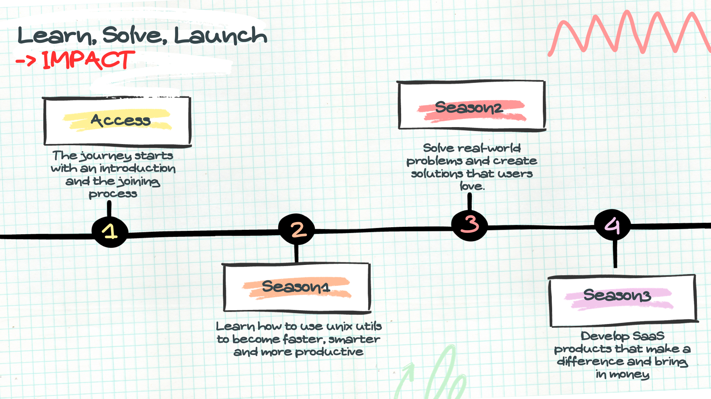

<h1 align="center">
  
</h1>
<h4 align="center">
  <a href="./how-we-got-here.md">WHY</a> | 
  <a href="./sprints.md">JOIN</a> | 
  <a href="./faq.md">FAQ</a>
</h4>

 

Picture this: You're twice, maybe three times as efficient as an engineer with mac or windows. That sounds impressive, doesn't it?

 

I'll have to disagree. **it's a bit of a waste.**

 

Many engineers would kill for that `2X` or `3X` advantage. But hear me out— *there are better investments.*
Why invest significant effort in achieving marginal productivity gains? That time could be better utilized in pursuing endeavors that hold the potential to transform your career path.

The true game-changer lies in elevating your productivity skills to a level that surpasses that of your peers `100X`, `200X`.

However reaching that pinnacle is neither easy nor swift. It demands a special mentor, unwavering dedication and a relentless pursuit of excellence, 
but once you reach that level that leaves others in awe and unable to comprehend your capabilities, you transform into the epitome of innovation, becoming the envy of your peers.

**This is the level that's worth investing your all into achieving.** If you are willing to put in the effort, this is for you.

 

## 2. The Outcome
Is mastery the ultimate goal? **Absolutely not!**

No matter how proficient you become with specific tools, no matter how sophisticated or cutting-edge they may be, and no matter how much effort you invest, tools are just that – **tools**. It's the underlying philosophy, mindset, and vision driving the use of these tools that truly matters.

The reason these sprints are challenging is because they're not just about acquiring skills. You can be highly skilled in something and still not succeed in life. So, before you obsess over outcomes and transformations, ask yourself: how can I use my skills and knowledge to positively impact someone else's life?

That's a far more meaningful question, one that can help us identify where to focus our energies. It's about mastering what truly matters and then channeling that expertise into creating innovations and solutions that make a real difference in the lives of others.

The next section will delve into how each season is meticulously designed with these principles in mind.

 

## 3. The Path

Finding the sweet spot between paying attention to the nitty-gritty details and grasping the big picture is key.
It's like trying not to get lost in the maze of technical intricacies that might seem like progress, but in reality, could lead you down a path of diminishing returns.

I'll be your trusty guide, pointing out the crucial bits and waving a red flag when diving deeper isn't the best use of your time.

There comes a moment when the small gains don't pack the same punch, and the energy you put in doesn't quite match the rewards you're reaping.
So, here's the plan—a three-part journey, each phase crafted to hit specific goals.

 

+ [Season 3](./s3.md)
+ [Season 2](./s2.md)
+ [Season 1](./s1.md)

 

## 4. How To Join
Explore the latest sprints [here](./sprints.md).

 

## 5. Conclusion
This as an opportune moment to create these chellenging adventures. I am inspired to enable you to become the most competent engineer you can be, thereby sculpting a fulfilling and influential career.

**As an engineer, you possess a unique potential to impact the world through your projects, innovations, and solutions.**

 

*Best of luck on your transformative journey! To stay in the loop and participate with ideas, Join me on Twitter [@cipherlogs](https://twitter.com/intent/follow?screen_name=cipherlogs).*
